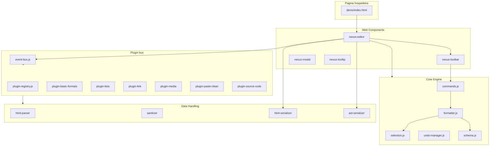
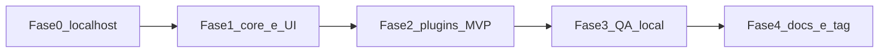

# Roadmap de implementação — Nexus WYSIWYG

Documento-base: [documentacao-base.md](./documentacao-base.md).

O Nexus é um editor de texto rico (WYSIWYG) em JavaScript puro, com ES modules nativos e Web Components, **sem dependências de runtime**. Este roadmap define a ordem de implementação até o **v1.0.0**.

## Princípios de execução

- **Velocidade:** o cronograma de 11 semanas do plano de projeto é um teto, não um calendário. As fases abaixo são **ordem de desbloqueio**; o objetivo é concluir o MVP no localhost o quanto antes.
- **Só localhost até o v1.0.0:** validação com `npm run dev`, `npm test` e `npm run e2e` na máquina local. Sem staging, GitHub Pages, Lighthouse CI remoto ou GitHub Actions obrigatório.
- **GitFlow leve:** `main`, `develop` e `feature/`* quando fizer sentido.
- **Design:** se o Figma não estiver pronto, usar tokens CSS iniciais e iterar depois.


## Stack e testes


| Camada           | Escolha                                       |
| ---------------- | --------------------------------------------- |
| Runtime          | JavaScript puro, ES modules, Web Components   |
| Bundle           | ESM nativo (sem transpile em produção)        |
| Testes unitários | Vitest + jsdom                                |
| Testes E2E       | Playwright (contra demo no localhost)         |
| Dev-only         | ESLint, Vitest, Playwright, servidor estático |


## Decisões de alinhamento

- **Vitest** em vez de Jest (ver `.cursor/rules/testing-standards.mdc`).
- **Sem bundler de produção:** teto de 100 kb gzip medido via `npm run check:size` no grafo de módulos.
- **Mídia:** interface `StorageAdapter`; MVP com adapter local (`blob:` / FileReader). S3/Cloudinary pós-v1.
- **Markdown:** entrada Markdown fica pós-v1; MVP cobre HTML + serialização HTML5/JSON-AST.
- **CI remoto e deploy:** fora de escopo até a conclusão do projeto.


## Arquitetura-alvo




### Contrato público mínimo

```javascript
const editor = document.querySelector('nexus-editor')
editor.getContent({ format: 'html' | 'ast' })
editor.setContent(html)
editor.execCommand('bold' | 'italic' | 'underline' | 'insertLink' | ...)
```


### Estrutura de pastas

```
src/
  core/                 # Selection/Range, commands, formatter, undo, schema
  ui/                   # Custom Elements + Shadow DOM (toolbar, modal, tooltip)
  plugins/              # um diretório por plugin
  data/                 # parser, sanitizer, serializers HTML/AST
  shared/               # event-bus, tokens CSS, utils
  nexus-editor.js       # Custom Element raiz; createNexusEditor()
demo/index.html         # playground (npm run dev → localhost)
assets/styles/tokens.css
```

A chrome (toolbar, modais) usa Shadow DOM + CSS Parts; o conteúdo editável fica fora do shadow para o HTML publicado ser idêntico ao renderizado (ver ADR-001 em `docs/architecture/`).

### Caminho crítico




bootstrap localhost → selection/formatter/commands → `nexus-editor` + toolbar → plugin bus → plugins em paralelo → sanitizer/export → baterias locais

---


## Fase 0 — Inception

**Duração estimada:** horas a 1–2 dias  
**Entregável:** repositório executável no localhost + ADRs mínimos

1. **ADRs** em `docs/architecture/`:
  - ADR-001: `contenteditable` light DOM vs iframe
  - ADR-002: DOM vivo + AST só na serialização
  - ADR-003: plugin = `{ name, init(editor), commands, shortcuts, destroy }`
  - ADR-004: StorageAdapter local
2. **Tokens CSS** em `:root` / `nexus-editor` (`--color-`*, `--space-*`, `--font-*`)
3. **Bootstrap mínimo:**
  - `.gitignore`, `package.json` (`type: module`), ESLint, Vitest, Playwright
  - `demo/index.html` + `npm run dev` (servidor estático ESM)
  - Scripts: `npm test`, `npm run e2e`, `npm run check:size` (size-check pode entrar na Fase 3)
4. **Critério de saída:** `npm run dev` abre o demo; `npm test` passa no skeleton

---


## Fase 1 — Fundação

**Entregável:** Core Engine + Web Components base + plugin bus + `basic-formats`

### Bloco A — Core Engine

Módulos em `src/core/`:


| Módulo            | Responsabilidade                                                                            |
| ----------------- | ------------------------------------------------------------------------------------------- |
| `selection.js`    | wrap `getSelection`/`Range`; bookmarks de seleção                                           |
| `schema.js`       | allowlist MVP (`p`, `h1–h3`, `strong`, `em`, `u`, `ul`/`ol`/`li`, `blockquote`, `a`, `img`) |
| `formatter.js`    | apply/remove inline e block via `Range`                                                     |
| `commands.js`     | `bold`, `italic`, `underline`, `formatBlock`                                                |
| `undo-manager.js` | snapshots HTML + seleção; Ctrl+Z / Ctrl+Y                                                   |


Atalhos RF01: `Ctrl+B`, `Ctrl+I` (`Ctrl+K` na Fase 2).

### Bloco B — UI Web Components

- `nexus-editor`: host, `contenteditable`, `getContent`/`setContent`/`execCommand`
- `nexus-toolbar`: botões semânticos, `aria-pressed`, layout responsivo (RF02)
- `nexus-tooltip` e `nexus-modal`
- A11y (RNF03): foco visível, `role="toolbar"`, área com `role="textbox"` + `aria-multiline="true"`


### Bloco C — Plugin bus + basic-formats

- `event-bus.js` + `plugin-registry.js`: `use(plugin)`, `enable`/`disable`, teardown
- Plugin **basic-formats** (B/I/U + H1–H3 + blockquote) na toolbar

**Critério de saída:** formatos básicos com teclado e toolbar; undo restaura seleção.

---


## Fase 2 — Features MVP

**Entregável:** listas, links, paste clean, mídia local, modo código, export HTML + AST

Plugins podem ser desenvolvidos em paralelo após o bus estar pronto.

1. **Listas + links** — `ul`/`ol`, indent/outdent; modal de link com `Ctrl+K`; `target="_blank"` com `rel="noopener noreferrer"`
2. **Data Handling + paste** — parser HTML no schema; sanitizer de paste (Word/Docs); serializers HTML5 e JSON AST
3. **Mídia** — file picker, resize via attrs `width`/`height`; `StorageAdapter` local
4. **Modo código (RF03)** — vista fonte + round-trip; `getContent({ format: 'html' | 'ast' })`

**Critério de saída:** escopo MVP do plano de projeto + RF01–RF03 cobertos por testes locais.

---


## Fase 3 — Estabilização

**Entregável:** suíte local verde + critérios de aceite

1. **Vitest** — cobertura ≥ 85% em `src/core`, `src/data`, `src/plugins`
2. **Playwright E2E** — fluxos críticos no localhost (paste, atalhos, undo, link, imagem, modo código)
3. **Cross-browser local** — Chromium, Firefox, WebKit (limitações de engine no WSL documentadas em `docs/qa/` se necessário)
4. **Performance** — bundle ≤ 100 kb gzip; LCP da demo < 0,8 s (medição local)
5. **Qualidade de saída** — HTML válido, sem estilos inline
6. **CSP** — meta CSP no demo localhost

**Critério de saída:** scripts locais verdes.

---


## Fase 4 — Entrega

**Entregável:** v1.0.0 usável via `npm run dev` + documentação

1. `README.md` na raiz + `docs/api.md`
2. Changelog e tag `v1.0.0`
3. Sem deploy remoto nesta fase

---


## Mapeamento requisitos → fase


| Requisito                         | Fase                      |
| --------------------------------- | ------------------------- |
| RF01 — atalhos B/I                | 1                         |
| RF01 — Ctrl+K (link)              | 2                         |
| RF02 — toolbar responsiva         | 1 (layout) + 2 (overflow) |
| RF03 — modo código                | 2                         |
| RNF01 — 100 kb gzip / LCP < 0,8 s | 3 (medição)               |
| RNF02 — browsers                  | 3 (Playwright local)      |
| RNF03 — WCAG 2.1 AA               | 1 + auditoria na 3        |


## Riscos e mitigação


| Risco                                | Mitigação                                              |
| ------------------------------------ | ------------------------------------------------------ |
| Selection API inconsistente (Safari) | Abstração em `selection.js` + testes WebKit locais     |
| Shadow DOM vs estilos do host        | Chrome em Shadow DOM; conteúdo editável fora do shadow |
| Storage externo (S3/Cloudinary)      | Adapter local no MVP; integração pós-v1                |
| WSL sem WebKit                       | Validar o que o Playwright local permitir              |


## Fora de escopo v1.0

Tabelas, Markdown de entrada, colaboração, spellcheck, temas extras, dependências de runtime, backend de upload, deploy/staging/CI na nuvem.